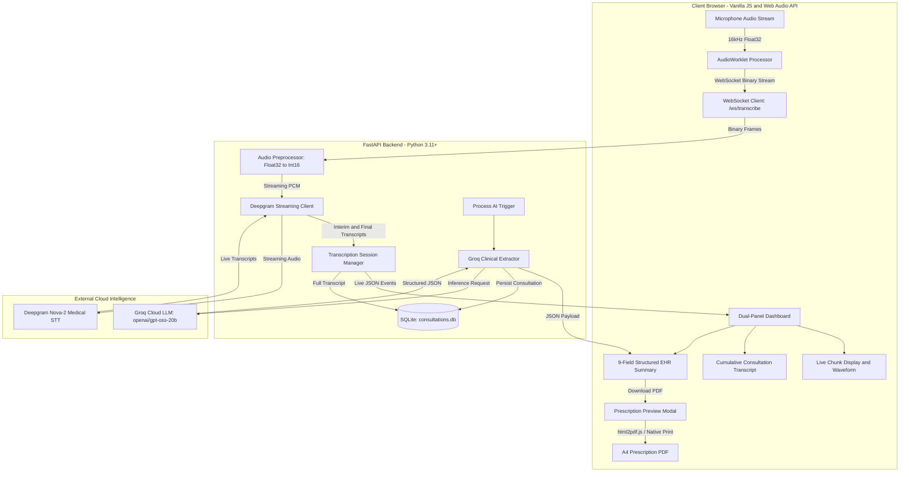

# 🏗️ System Architecture & Data Flow Specification

This document details the architectural design, audio streaming pipeline, WebSocket protocols, clinical extraction flow, and end-to-end data lifecycle for the **JD Doctors Clinic Live Ambient AI Medical Scribe & Clinical EHR System**.

---

## 1. System Architecture Diagram

### Visual Architecture Flowchart

```
┌────────────────────────────────────────────────────────────────────────────────────────┐
│                        1. AMBIENT DOCTOR-PATIENT CONSULTATION                          │
│               Natural speech captured via browser mic in examination room              │
└───────────────────────────────────────────┬────────────────────────────────────────────┘
                                            │ Web Audio API (16kHz Mono Float32)
                                            ▼
┌────────────────────────────────────────────────────────────────────────────────────────┐
│                     2. CLIENT-SIDE AUDIOWORKLET & WEBSOCKET                            │
│           AudioWorklet processor captures audio chunks in separate thread              │
└───────────────────────────────────────────┬────────────────────────────────────────────┘
                                            │ /ws/transcribe (Raw Binary PCM Stream)
                                            ▼
┌────────────────────────────────────────────────────────────────────────────────────────┐
│                     3. FASTAPI BACKEND & AUDIO PREPROCESSING                           │
│           NumPy converts Float32 to Int16 Little-Endian PCM @ 16,000 Hz                │
└───────────────────────────────────────────┬────────────────────────────────────────────┘
                                            │ wss://api.deepgram.com/v1/listen
                                            ▼
┌────────────────────────────────────────────────────────────────────────────────────────┐
│                     4. DEEPGRAM NOVA-2 MEDICAL CLOUD STREAMING                         │
│           Sub-300ms low-latency interim & finalized medical speech recognition         │
└─────────────────────┬────────────────────────────────────────────┬─────────────────────┘
                      │ Interim Events                             │ Finalized Sentences
                      ▼                                            ▼
       ┌───────────────────────────────┐            ┌───────────────────────────────┐
       │     TOP LIVE CHUNK BOX        │            │   BOTTOM CUMULATIVE BOX       │
       │  Pulsing Waveform + Live Words│            │ Complete Consultation Dialogue│
       └───────────────────────────────┘            └──────────────┬────────────────┘
                                                                   │
                                    Click "⚡ Process Transcript"  │
                                                                   ▼
┌────────────────────────────────────────────────────────────────────────────────────────┐
│                5. GROQ CLOUD CLINICAL LLM (openai/gpt-oss-20b)                         │
│       Single-pass extraction into 9 standardized clinical EHR field groups (<1.5s)     │
│       Strictly isolates Reported Positives (+) from Stated Pertinent Negatives (-)     │
└─────────────────────┬────────────────────────────────────────────┬─────────────────────┘
                      │                                            │
                      ▼                                            ▼
┌──────────────────────────────────────────────┐ ┌───────────────────────────────────────┐
│     6. SQLITE SESSION DATABASE               │ │    7. FORMATTED PRESCRIPTION PDF      │
│  consultations.db (1-click reload & history) │ │  Preview Modal, A4 Download & Print   │
└──────────────────────────────────────────────┘ └───────────────────────────────────────┘
```

### Mermaid Architecture (For Supported Viewers)



---

## 2. Step-by-Step Data Flow Lifecycle

The platform operates through a 7-step sequential data pipeline from ambient consultation speech to a structured EHR note and prescription PDF:

```
[Ambient Speech] 
  ──(1)──> [Web Audio API 16kHz] 
  ──(2)──> [WebSocket Binary Stream] 
  ──(3)──> [Float32 to Int16 PCM Conversion] 
  ──(4)──> [Deepgram Nova-2 Medical STT] 
  ──(5)──> [Live UI Event Stream] 
  ──(6)──> [Groq LLM Clinical Extraction] 
  ──(7)──> [SQLite Persistence & PDF Export]
```

### Step 1: Client-Side Audio Capture (Web Audio API)
- **Input**: The doctor and patient converse naturally in the examination room.
- **Capture**: The browser requests microphone access via `navigator.mediaDevices.getUserMedia({ audio: { sampleRate: 16000, channelCount: 1, echoCancellation: true, noiseSuppression: true } })`.
- **AudioWorklet Thread**: A dedicated `AudioWorkletNode` receives raw audio buffers at 16 kHz mono on a separate background audio thread, preventing main UI thread stuttering or dropped frames.

### Step 2: Binary Frame Transmission over WebSocket
- **Chunking**: The worklet accumulates `Float32Array` PCM audio frames (typically 2048 to 4096 samples, ~128ms - 256ms).
- **Transport**: The client streams raw binary frames over a persistent WebSocket connection (`ws://127.0.0.1:8000/ws/transcribe`).
- **Low Overhead**: Audio is transmitted as raw binary buffers without Base64 encoding overhead, preserving minimal bandwidth and $< 10$ms transport latency.

### Step 3: Backend Audio Preprocessing & Normalization
- **Int16 Conversion**: The FastAPI server receives the binary buffer. In [`backend/audio/processor.py`], NumPy efficiently normalizes the `Float32` array (values between $-1.0$ and $+1.0$) and converts it to standard 16-bit linear PCM (`int16`, signed little-endian) at 16,000 Hz.
- **Audio Hygiene**: The server verifies frame consistency and streams normalized PCM bytes directly to the upstream ASR client.

### Step 4: Real-time Cloud ASR via Deepgram Nova-2 Medical
- **Connection**: Backend maintains an active streaming connection with Deepgram's live endpoint (`wss://api.deepgram.com/v1/listen?model=nova-2-medical&encoding=linear16&sample_rate=16000&smart_format=true&interim_results=true`).
- **Speech Recognition**:
  - **Interim Transcripts**: Deepgram continuously evaluates incoming speech chunks and returns low-latency interim hypotheses ($< 250$ms).
  - **Finalized Speech Segments**: When natural pauses or sentence completions occur, Deepgram emits final transcripts with punctuation, medical terminology, and capitalization.

### Step 5: Live Transcript Merging, Deduplication & UI Broadcast
- **Session Management**: [`backend/transcript/session.py`] tracks cumulative word counts, chunk metrics, and chronological transcript segments.
- **Real-time Event Dispatch**: The backend broadcasts structured JSON packets over the WebSocket back to the browser:
  - `type: "interim"`: Displays currently spoken words in the top **Live Chunk Box** with active waveform animation.
  - `type: "final"`: Appends completed sentences into the bottom **Cumulative Consultation Transcript** box.
  - `type: "stats"`: Updates live `WORDS`, `CHUNKS`, and `VAD` indicator badges.

### Step 6: On-Demand Clinical NLP Extraction via Groq Cloud
- **Trigger**: The clinician clicks **`⚡ Process Transcript with AI`** (or clicks **`Stop`**).
- **Prompt Engineering**: The cumulative transcript is assembled and sent to [`backend/llm/groq_client.py`].
- **Model Execution**: The request is routed to Groq Cloud running **`openai/gpt-oss-20b`** (with dynamic automatic fallback to `llama-3.3-70b-versatile`).
- **Strict Schema Isolation**: The LLM analyzes the entire dialogue in a single pass under 1.5 seconds, categorizing clinical data into 9 discrete field groups and strictly separating:
  - **Reported Positives (`+`)**: e.g., "Patient reports sharp epigastric pain for 3 days."
  - **Stated Pertinent Negatives (`-`)**: e.g., "Denies vomiting, fever, or shortness of breath."

### Step 7: Dual-Destination Persistence & Formatted Output
1. **Relational Database (`consultations.db`)**:
   - The session, timestamp, full transcript, demographics, and the 9 clinical JSON fields are saved to SQLite via [`backend/db/database.py`].
   - The consultation becomes immediately available in the **History Drawer** for 1-click reload.
2. **Hospital Prescription PDF**:
   - The frontend populates the 9 fields and renders the **Prescription Preview Modal**.
   - Clinicians can click **`📄 Download Prescription (PDF)`** to download an authentic A4 PDF or click **`🖨️ Print / Save PDF`** for native vector print export.

---

## 3. Communication Protocols & Endpoints

| Protocol | Endpoint | Direction | Payload Type | Description |
| :--- | :--- | :--- | :--- | :--- |
| **WebSocket** | `/ws/transcribe` | Client $\rightarrow$ Server | Binary (Float32 PCM) | Real-time audio stream. |
| **WebSocket** | `/ws/transcribe` | Server $\rightarrow$ Client | JSON (`interim`, `final`, `stats`) | Live transcript updates and ASR events. |
| **WebSocket** | `/ws/transcribe` | Client $\rightarrow$ Server | JSON (`action: "process_ai"`) | On-demand trigger to process cumulative transcript. |
| **REST POST** | `/api/extract` | Client $\rightarrow$ Server | JSON (`{ "transcript": "..." }`) | HTTP fallback for clinical LLM extraction. |
| **REST GET** | `/api/consultations` | Client $\leftrightarrow$ Server | JSON Array | Retrieves recent consultations from SQLite. |
| **REST GET** | `/api/consultations/{id}` | Client $\leftrightarrow$ Server | JSON Object | Retrieves full transcript and 9-field EHR record. |
