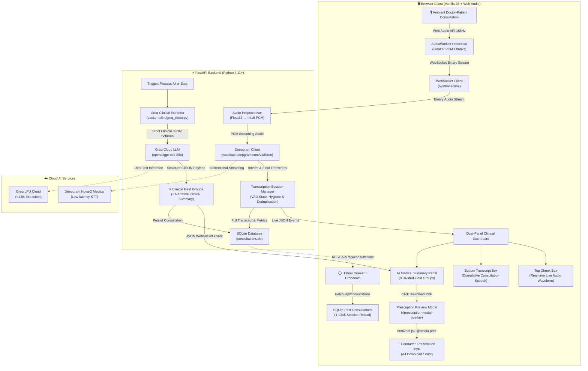

# 🩺 JD Doctors Clinic — Live Ambient AI Medical Scribe & Clinical EHR System

An end-to-end ambient medical transcription and clinical EHR intelligence platform designed for modern healthcare practices. The application captures natural doctor-patient consultations via the browser microphone, transcribes speech with ultra-low latency using **Deepgram Nova-2 Medical STT**, extracts 9 standardized clinical EHR field groups using **Groq Cloud LLMs (`openai/gpt-oss-20b` with dynamic model fallback)**, renders a dual-panel interface matching clinical specifications, and provides 1-click **Formatted Prescription PDF** generation and **SQLite Session Persistence**.

---

## 🎯 Problem Statement (PS)

- **The 2:1 Administrative Burden**: Clinicians spend nearly 2 hours entering EHR notes for every 1 hour of direct consultation, driving physician burnout and "pajama time".
- **Broken Doctor-Patient Rapport**: Continuous typing during consultations diverts eye contact and degrades the therapeutic relationship.
- **Documentation Fatigue & Errors**: Post-shift charting from memory leads to missed pertinent negatives, dosage inaccuracies, and diagnostic ambiguity.
- **The Ambient AI Solution**: An ambient assistant listening via the browser mic, transcribing medical speech with Deepgram Nova-2 Medical, extracting 9 structured EHR fields (strictly isolating positive from denied symptoms) with Groq LLMs in $<1.5$s, and generating instant hospital prescription PDFs.

---

## 🔄 End-to-End System Workflow (Mermaid)



## 🛠️ Technology Stack

| Layer / Component | Technology / Library | Version / Model | Role & Purpose |
| :--- | :--- | :--- | :--- |
| **Frontend UI** | HTML5, CSS3, Vanilla JavaScript | Native Web Standards (ES6+) | Dual-column responsive layout matching assignment reference; zero npm build step. |
| **Audio Capture** | Web Audio API (`AudioWorklet`) | 16,000 Hz, 1-Channel Mono | High-fidelity raw PCM audio capture in separate audio thread. |
| **PDF Generation** | `html2pdf.js` + Native `@media print` | v0.10.1 / Browser Native Engine | Dual-mode medical prescription engine (A4 client-side PDF download + high-resolution vector print). |
| **Backend Web Framework** | FastAPI | `>= 0.109.0` | Asynchronous REST endpoints (`/api/consultations`, `/api/extract`) and WebSocket connection manager. |
| **ASGI Web Server** | Uvicorn (Standard) | `>= 0.27.0` | High-throughput asynchronous server supporting concurrent WebSocket clients. |
| **WebSocket Streaming** | `websockets` / `aiofiles` | `>= 12.0` | Full-duplex binary audio streaming and real-time JSON event dispatching. |
| **Audio Processing** | NumPy | `>= 1.24.0` | High-efficiency Float32 to Int16 PCM downsampling and array buffer manipulation. |
| **Speech-to-Text (STT)** | Deepgram Cloud Streaming SDK | `>= 3.0.0` (Model: `nova-2-medical`) | Specialized real-time medical speech recognition with continuous endpointing. |
| **Clinical LLM Engine** | Groq Cloud API | `>= 0.9.0` (Model: `openai/gpt-oss-20b`) | Single-pass structured extraction of 9 clinical field groups with dynamic auto-fallback. |
| **Data Validation** | Pydantic v2 | `>= 2.0.0` | Strict data validation, schema enforcement, and JSON serialization. |
| **Database & Persistence** | SQLite 3 | Embedded (`consultations.db`) | Relational persistence for full transcripts, audio metrics, and structured EHR payloads. |
| **Environment Config** | `python-dotenv` | `>= 1.0.0` | Secure environment variable isolation for secret API credentials. |

---

## 🩺 Clinical Features & The 9 EHR Field Groups

### Dual-Panel Interface (Assignment Specification)
- **Left Panel (Live Transcription)**: Pill controls (`Start Mic`, `Stop`, `Clear`, `Save Recording`), stats badges (`WORDS`, `CHUNKS`, `VAD`), top live chunk box with waveform, bottom cumulative transcript, and full-width `⚡ Process Transcript with AI` action button.
- **Right Panel (AI Medical Summary)**: Patient demographics (`Dr Tushar`, `30`, `Male`), active shimmer loading feedback, and the 9 uppercase clinical sections:

| # | Clinical Field Group | Description & Scope |
| :-: | :--- | :--- |
| **1** | **Clinical Summary** | Comprehensive 2-4 sentence narrative synthesizing the patient visit in an editable textarea. |
| **2** | **Chief Complaints** | Primary reason for visit in patient's own words. |
| **3** | **Symptoms (+ / -)** | Discrete symptom chips strictly separated into **reported positives (+)** and **stated negatives (-)**. |
| **4** | **Clinical Impression** | Provisional diagnosis or differential diagnoses stated by clinician. |
| **5** | **Medications** | Current medicines, dosages, route, adherence, and medication history. |
| **6** | **Examinations & Tests** | Vitals (BP, HR, SpO2, Temp), physical examination findings, and ordered laboratory tests. |
| **7** | **Allergies** | Known drug allergies highlighted with warning alert. |
| **8** | **Past Medical History** | Prior medical conditions, surgeries, chronic illnesses, and hospitalizations. |
| **9** | **History & Follow-Up** | Onset, duration, progression, aggravating/relieving factors, lifestyle advice, and follow-up plan. |

### Prescription Modal & PDF Engine
- **`📄 Download Prescription (PDF)`**: Opens an on-screen **Prescription Preview Modal** and downloads an authentic A4 PDF (`Prescription_Dr_Tushar_YYYY-MM-DD.pdf`) with clinic letterhead, demographics, Rx table, and doctor signature.
- **`🖨️ Print / Save PDF`**: Direct high-resolution vector PDF export via native browser print engine (`@media print`).
- **`📋 Copy Plain Text`**: Fast clipboard copy of raw clinical encounter text.

### History & Session Persistence
- **`🕒 History Drawer` & Header Dropdown**: Fetches previous sessions from local SQLite (`consultations.db`).
- **1-Click Reload**: Instantly repopulates both the full speech transcript and the 9-field EHR summary onto the screen.

---

## 💾 Database Schema (`consultations.db`)

```sql
CREATE TABLE IF NOT EXISTS consultations (
    id TEXT PRIMARY KEY,
    created_at TEXT NOT NULL,
    duration_seconds REAL,
    word_count INTEGER,
    full_transcript TEXT,
    patient_name TEXT, patient_age TEXT, patient_sex TEXT, patient_identifiers TEXT,
    chief_complaint TEXT,
    hpi_onset TEXT, hpi_duration TEXT, hpi_progression TEXT, hpi_aggravating TEXT, hpi_relieving TEXT,
    positive_symptoms TEXT, stated_negatives TEXT,
    past_medical_history TEXT,
    current_medications TEXT, medication_adherence TEXT, known_allergies TEXT,
    vitals TEXT, examination_findings TEXT,
    assessment TEXT,
    plan_investigations TEXT, plan_prescriptions TEXT, plan_advice TEXT, plan_follow_up TEXT,
    clinical_summary_json TEXT
);
```

---

## 🚀 Setup & Installation Guide

### 1. Virtual Environment Setup

**Windows (PowerShell)**:
```powershell
python -m venv venv
.\venv\Scripts\Activate.ps1
```
*(If script execution is restricted: `Set-ExecutionPolicy -Scope Process -ExecutionPolicy Bypass`)*.

**macOS / Linux**:
```bash
python3 -m venv venv && source venv/bin/activate
```

### 2. Install Dependencies
```bash
pip install -r requirements.txt
```

### 3. API Keys Setup
- **Deepgram API Key (STT)**: Sign up at **[console.deepgram.com](https://console.deepgram.com/signup)** ($200 free credits included) → Go to **API Keys** → **Create Key** (Member access) → Copy key.
- **Groq API Key (Clinical LLM)**: Sign up at **[console.groq.com](https://console.groq.com)** → Go to **API Keys** → **Create Key** → Copy secret key. *(Uses `openai/gpt-oss-20b` with auto-fallback to `llama-3.3-70b-versatile`)*.

### 4. Configure Environment (`.env`)
Create `.env` in the root folder:
```env
DEEPGRAM_API_KEY=your_deepgram_api_key_here
DEEPGRAM_MODEL=nova-2-medical
GROQ_API_KEY=your_groq_api_key_here
GROQ_MODEL=openai/gpt-oss-20b
HOST=127.0.0.1
PORT=8000
```

### 5. Run & Test Application
```powershell
python start.py
```
Open **`http://127.0.0.1:8000`** in your browser:
1. Click **Start Mic** and speak clinical dialogue (observe live chunk waveform and transcript accumulation).
2. Click **⚡ Process Transcript with AI** (or **Stop**) to extract the 9 structured clinical fields.
3. Click **📄 Download Prescription (PDF)** to preview the modal and download the PDF.
4. Click **🕒 History** to review and reload past consultations from SQLite.
